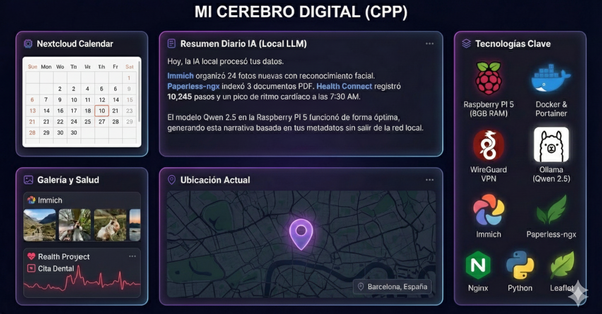

# Mi Cerebro Digital (CPP)

**Tu vida, conectada y resumida de manera totalmente gratuita.**

## 📖 Introducción

En la actualidad, nos enfrentamos a una elección forzada: ceder nuestra privacidad a grandes corporaciones tecnológicas o renunciar a la comodidad de la nube. **Mi Cerebro Digital** nace como una respuesta ética y técnica a este dilema, proponiendo un Cloud Personal Privado (CPP) donde la soberanía de los datos es absoluta.

Más allá de un simple sistema de copias de seguridad, este proyecto transforma el almacenamiento pasivo en una memoria activa. Mediante una infraestructura auto-alojada físicamente en el hogar y un motor de Inteligencia Artificial Local, el sistema unifica tus fotos, documentos y métricas de salud para narrar la historia de tu día a día. Todo ello garantizando que tu información más íntima nunca salga de tu propia red.

## 🚀 Objetivos del Proyecto

* **Soberanía de Datos:** Alojamiento físico de la información en una Raspberry Pi 5, eliminando intermediarios.
* **Privacidad Absoluta:** Uso de VPN (WireGuard) y procesamiento de IA en el borde (*Edge Computing*), sin enviar datos a la nube pública.
* **Agregación de Datos:** Unificación de fuentes heterogéneas:
    * 📸 Fotos y Vídeos (Immich).
    * 📄 Documentos (Paperless-ngx).
    * ❤️ Salud (Health Connect: Pasos y Sueño).
    * 🗓️ Agenda (Nextcloud Calendar: Eventos y Citas).
    * 🗺️ Ubicación (Leaflet.js: Rutas y Lugares Visitados).
* **Narrativa con IA:** Implementación de un LLM local para convertir metadatos fríos en historias coherentes sobre tu día.

## 🛠️ Arquitectura y Tecnologías

El proyecto utiliza una arquitectura de microservicios contenerizados sobre hardware de bajo consumo optimizado para alto rendimiento I/O.

### Infraestructura
* **Hardware:** Raspberry Pi 5 (8GB RAM) con arranque desde SSD vía USB 3.0 para evitar cuellos de botella.
* **OS:** Raspberry Pi OS Lite (64-bit).
* **Orquestación:** Docker & Docker Compose, gestionado visualmente con **Portainer**.
* **Red y Seguridad:** Túnel VPN **WireGuard** para acceso remoto y autenticación SSH.

### Backend y Servicios de Datos
* **Immich:** Gestión de fotos con reconocimiento facial y mapas de calor.
* **Paperless-ngx:** Digitalización, OCR e indexado de documentos.
* **Nginx:** Servidor web ligero para el despliegue del dashboard.
* **Middleware:** Scripts personalizados en Python/Node.js para la ingesta y normalización de datos.

### Inteligencia Artificial (Local)
* **Motor:** Ollama ejecutándose en la Raspberry Pi.
* **Modelo:** Qwen 2.5 (1.5B), un modelo ligero y optimizado para hardware limitado.
* **Enfoque:** La IA procesa un CSV estructurado (ubicaciones, fechas, salud, ...) para generar texto narrativo.

### Frontend
* **Tecnologías:** HTML5, Tailwind CSS y JavaScript Vanilla (sin frameworks pesados para maximizar rendimiento).
* **Visualización:** Mapas interactivos con **Leaflet.js** para mostrar rutas basadas en las fotos del día.

## 📸 Galería de Funcionalidades

### 1. Panel de Control y Resumen IA
El usuario selecciona una fecha y el sistema genera una narrativa contando qué hizo, basándose en sus fotos, ubicación y salud.

### 2. Gestión de Contenedores
Monitorización en tiempo real del estado de los servicios (Immich, Postgres, Redis, etc.) mediante Portainer.

### 3. Servicios Auto-alojados (Immich y Paperless)
Integración completa de herramientas profesionales para la gestión de activos digitales.

## 🔄 El Desafío Técnico: Pivote de la IA

Durante el desarrollo (Fase PT4), nos enfrentamos a una limitación crítica: el uso de IA multimodal para "ver" y analizar píxeles de imágenes saturaba la CPU y RAM de la Raspberry Pi, provocando caídas del sistema.

**Nuestra Solución:**
Cambiamos el paradigma de **"Ver imágenes"** a **"Leer datos"**.
En lugar de procesar imágenes pesadas, desarrollamos un middleware que extrae metadatos (EXIF, coordenadas, contadores de pasos) y se los alimenta a la IA en formato CSV. Esto permitió generar resúmenes precisos con una latencia aceptable y sin comprometer la estabilidad del servidor.

## 🔮 Futuro del Proyecto

* **Voz a Texto:** Implementación de Whisper local para añadir notas de voz subjetivas al resumen diario.
* **Hardware NPU:** Integración de aceleradores como Coral Edge TPU para reducir tiempos de inferencia.
* **RAG (Retrieval-Augmented Generation):** Dotar a la IA de memoria a largo plazo mediante bases de datos vectoriales.

## 👥 Autores - Grupo 4

Este proyecto ha sido desarrollado como parte de la asignatura PTI (2025) por:

* **Iago Díaz Lamas** 
* **Enrique de Vicente-Tutor Castillo** 
* **Xavi Pascual Closa** 
* **Darío González Paniego**
